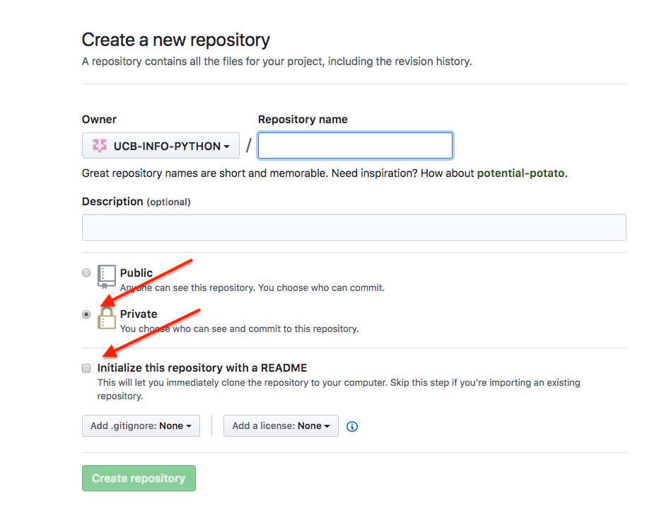
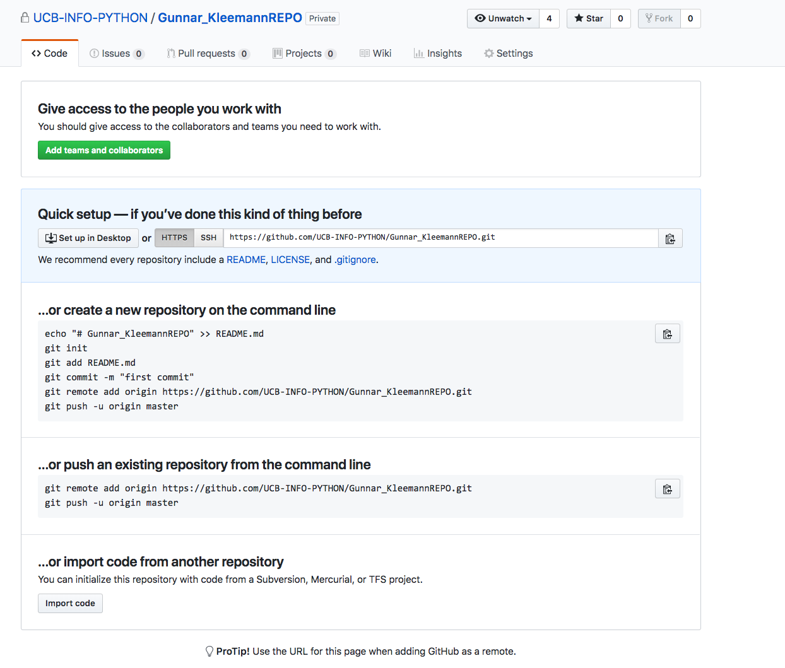
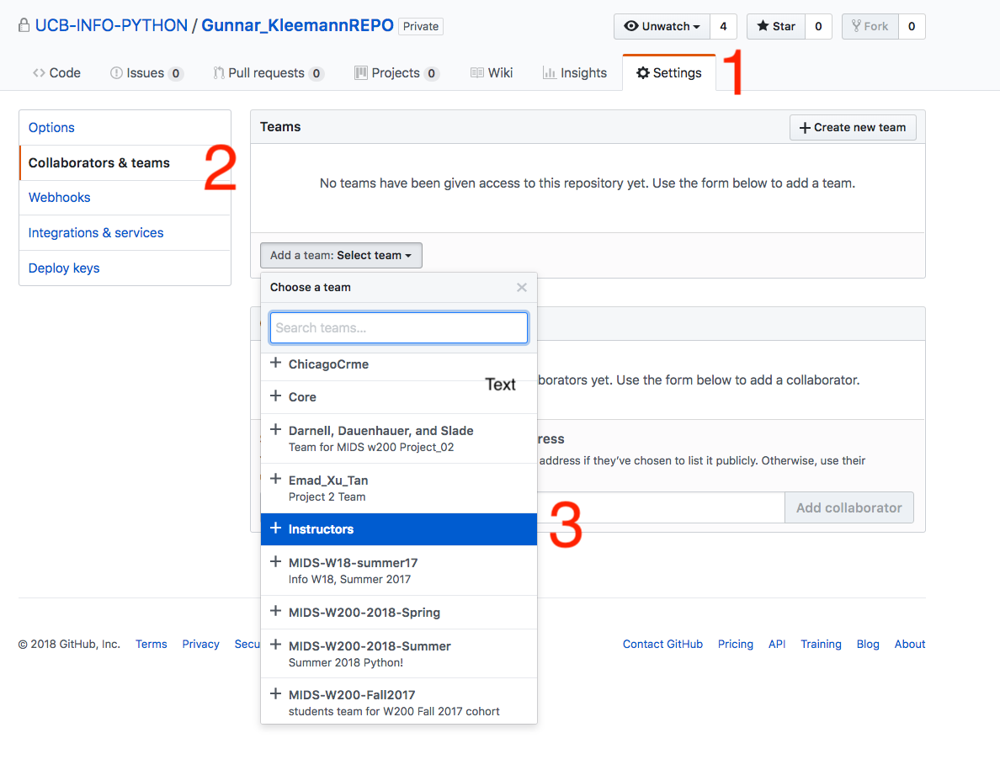

## First excercise with Git

Before proceeding, use the following instructions to set up your local assignment repository.  This will be the place you work on your class assignments and it will be linked to two remote repositories on GitHub making a V shaped unidirectional workflow:

**Download [1.15 The Course Workflow.pptx](https://github.com/UCB-INFO-PYTHON/Course-Syllabus/blob/master/week_01/1.15%20The%20Course%20Workflow.pptx) for a diagram of this process**

1. **assignments upstream Fall18** - You should be able to find this repository in our class organization on GitHub: **https://github.com/UCB-INFO-PYTHON/assignments_upstream_fall18**. This is where we will post all class assignments.  You have read access to this repository, and each week you will use a pull command to download the latest assignments to your own machine then push your submissions to your student repository **(recall the "V" shaped worflow)**.
2. **Your student repository** - In this excercise you will make your own student remote repository. You should have write access to your student repisitory, but it will be only readable by you and your instructors.  When you complete your homework each week, you will use a push command to upload your work to this repository.

## Initial Setup

There are several ways that you can set up your local repository.  We recommend the following procedure.  

First create an empty repository in Github for your homework, you can do this through the github user interface.


## Create a new repository

* this is done through add menu "+" on the top or the green NEW button on the upper right


--
* Put your repository in the MIDS-INFO-W18 organization
* Name it your FirstnameLastnameREPO so mine should be **"Gunnar\_KleemannREPO"**


--
* Make the repository **private** with the radio button

# Important: Do not add a readme file you need an empty repository


--
When you look at your repository it should look **LIKE THIS; this is an empty repo** 



# Give the instructors read access

* In your new **private** repository, go to the settings tab, on the right and then select collaborators and teams on the left

* Give (only) instructors read access:



* You should see this:


## Clone the assignments directory on your system


You need to tell git that you will be pulling content (homeworks) onto your machine from assignments_upstream_fall18 repository and pushing modified content (completed homeworks) to YourNameREPO repository on github

Open a command prompt and use it to navigate to your desktop or course working directory.  Then execute the following commands:

*Note: lines preceded by "#" are comments to explain each step and should not be executed.*

``` sh
# clone the assignment repository onto your computer

git clone https://github.com/UCB-INFO-PYTHON/assignments_upstream_fall18.git

# Note: This may be an empty repository at the beginning of the course.

cd assignments_upstream_fall18

# Add the assigments repo as the upstream (Think of **upstream as the "source"/where stuff comes from**)

git remote add upstream https://github.com/UCB-INFO-PYTHON/assignments_upstream_fall18.git
```

You can find the URL for YourNameREPO by navigating to the appropriate repository in your web browser, then clicking on the "Clone or download" button in the upper right corner.

``` sh
# set the origin (think of **origin this as the "sink"/where stuff goes**) to your personal repository

git remote remove origin
git remote add origin <ENTER YOUR REPOSITORY HTTPS URL HERE>

# i.e. git remote add origin https://github.com/UCB-INFO-PYTHON/Gunnar_KleemannREPO.git


```

To check if you did everything right, execute the following command:

``` sh
git remote -v
```

* The output should show "fetch" and "push" for two remotes, one named origin and one named upstream (rempo name may vary slightly from the image).


* You should also use the **ls** (list) command to confirm that the assignment files have been copied to your machine.


## Workflow for Each Week

Each week, you will begin by navigating to your local version of **assignments\_upstream\_fall18**, and downloading the latest changes from the remote **assignments\_upstream_fall18 repository. You do this with a git pull:

``` sh
git pull upstream master
```


**IMPORTANT** keep the original material intact, don't modify it in place or there can be nasty merge conflicts. You will make a separate folder **assignments\_upstream\_fall18/SUBMISSIONS** folder to keep your work separate from the originals.

* Make a copy of your assignment and move it to the SUBMISSIONS folder.

* Complete all the exercises in the **assignments\_upstream\_fall18/SUBMISSIONS** folder on your local machine and commit your changes to git.  

* Finally, you'll push your changes up to your personal student repository on github.  You can do this with the following command:

```sh
git push origin master
```


## Completing the Exercise

For this exercise you will post your first work to your personal version of the assignments\_upstream\_fall18 repository. The Github repository **installation** contains the exercise.


* Make a new folder called **"SUBMISSIONS"** in your local assignments_upstream_summer18 folder

  **IMPORTANT:** the SUBMISSIONS folder is the place that you can safely put modified files. Don't add or change files outside of the submissions folder because that can cause UGLY merge conflicts.

	* Try using the **mkdir** command from within your local assignments\_upstream\_fall18


* Now that you have your assignments_upstream repository set up on your computer *move out of it* and Clone the installation directory to your local machine

```sh
cd ..

git clone https://github.com/UCB-INFO-PYTHON/Installation.git
```

* Copy the file "First\_GitHub\_Exercise.txt"

	* From your local Installation repository.
To your local **assignments\_upstream\_fall18/SUBMISSIONS** folder.

	* To copy the file you can practice using the command line **cp** command or just drag and drop the file.

* Open the "First\_GitHub\_Exercise.txt", answer the questions, and save.

* Commit the changes to your local repository. Go back to your command terminal and type the following.

```sh
git status
```
* This should confirm that you have a modified file in your repository. Go ahead and add the file.

``` sh
git add SUBMISSIONS/

#check status to see that your file has been added as a new file (in green)

git status

#Then commit your changes.

git commit -m "completed GitHub exercise".

```
## Pushing Changes to GitHub

Now it is time to push your changes up to your GitHub repository. First, run `git status` to confirm that all your code is currently committed.  Next, push your changes to the master branch of origin, representing your repository on GitHub.

```sh
git push origin master
```

Check the GitHub repository in your browser to confirm that your changes are there.


## merging

* Note: from time to time you may have to merge the upstream and your local drive when you **pull** in a version of the repository that are not the same. you may see a screen like this, (Note: We are using an old (2016) repository in this example)


**This is VIM**, a command line text editor. you need to enter a short message overwriting one of the blue tilde and then write the message to file

to do this:

1) Type **i** to enter the "insert" mode (look to the bottom of the screen for the word "INSERT"

2) Use arrow keys to navigate to the line above the blue tilde and type in a message (any explanation about one line long)

3) Exit the insert mode by pushing **esc** ("INSERT" will disapear) then

4) type **:wq** this means *"write then quit"*
you should see some sort of message indicating that the merge was successful as shown below.

5) **Side Note:** If you have not made any changes VIM will not want to quit and you can force it to quit without recording changes using **:q!**. * Since you are entering a merge note, This should not happen, however it is good to note that VIM has a rich array of advanced commands; a topic better left for later.*


